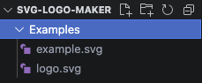

# SVG-logo Generator 

## Description

This command line application will walk the user through a short prompt in the CLI and auto-generate a basic SVG logo with a basic shapes:Circle, Triangle, and Square. It only allows for up to 3 Characters for the title of the logo .

# Table of Contents

[Description](#description)

[How to Install](#install)

[How to Use](#usage)

[How to contribute](#contribute)

[How to Test](#test)

[License](#license)

[Contact Me](#contact)

## Installation

To install, please first clone down main repository. After, please follow these instructions:

    1.Make sure you have node.js installed

    2.Run the command "npm i" to download remote modules required to run this CLI application

    3.Run the command "node index.js" to start the application

## Usage

The use of this application is to build a basic SVG logo to start your project or have basic placeholder when working on any styling for your porject. After you have run the application through the CLI, you will be prompted with questions about what styling you want your logo to have. For the title, we currently only allow for up to 3 charaters to be typed in as the logo is smaller in size. Feel free to type in any hexadecimal code for you backgroung color and text color as SVG curretnly supports this. Once the prompt has been anwsered. You will see a newly generated SVG file in the Examples directory with your specified styles from the prompt!

[Here is a Walkthough Video](https://drive.google.com/file/d/1pKkdwCBlGS7zS-YkxB-oGtUIf5qH305u/view)

## Contributing

If you would like to contribute, please feel free to contact me with any ideas or if you would like to be added on to this repository to help write more functionality to this CLI application!

## Tests

We currently are useing the remote module [Jest](https://jestjs.io/) to run test on the class constuctors built into the CLI application. If you are running into any issues with the Application, run the command "npm run test" to see where there are failers in the code.

This is a super helpful tool as it will show the developer the exact location and expectation of the function that is being test if an error is thrown!

## License

This project is licensed under the MIT license.
See [LICENSE](https://www.mit.edu/~amini/LICENSE.md) for more information!

## Question

If you have any questions or concerns about this project please contact me!

My gitHub account is: mmoun98

Link to my [gitHub](https://github.com/mmoun98) Account

You can always reach out via my email: mount.photos@gmail.com
